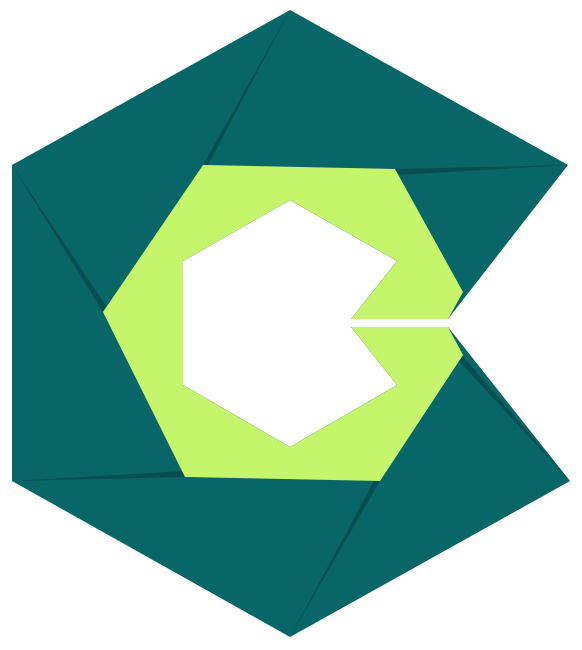
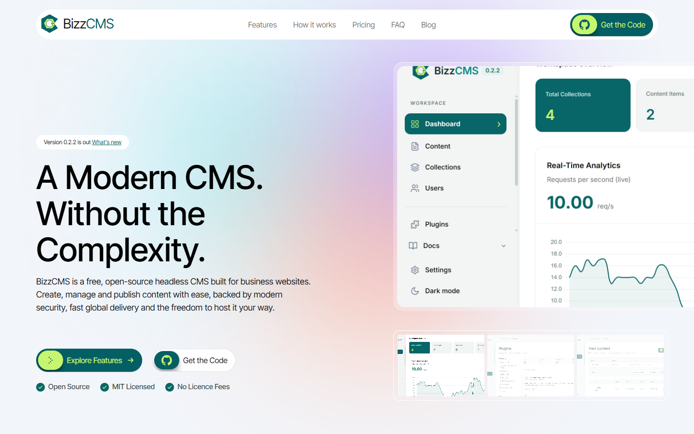
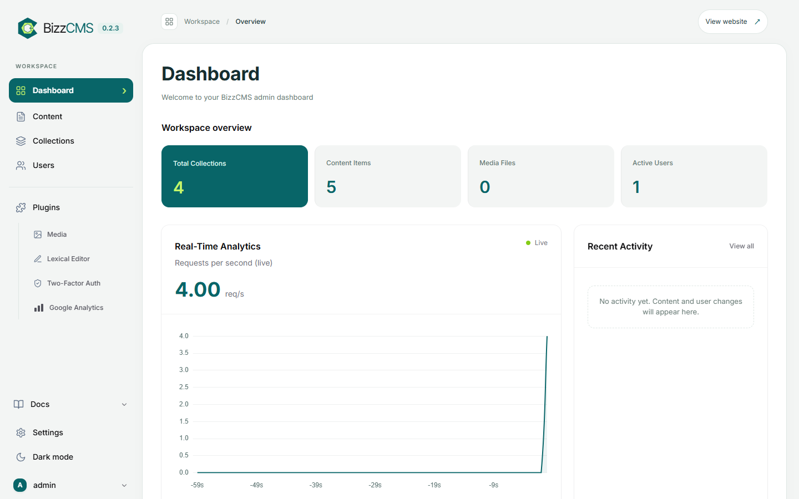
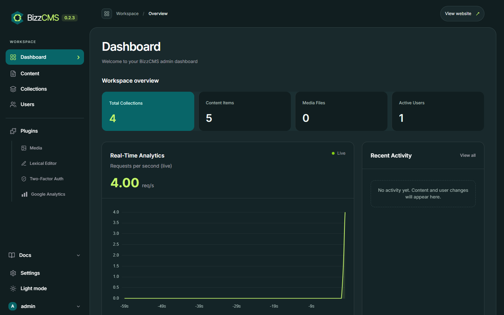
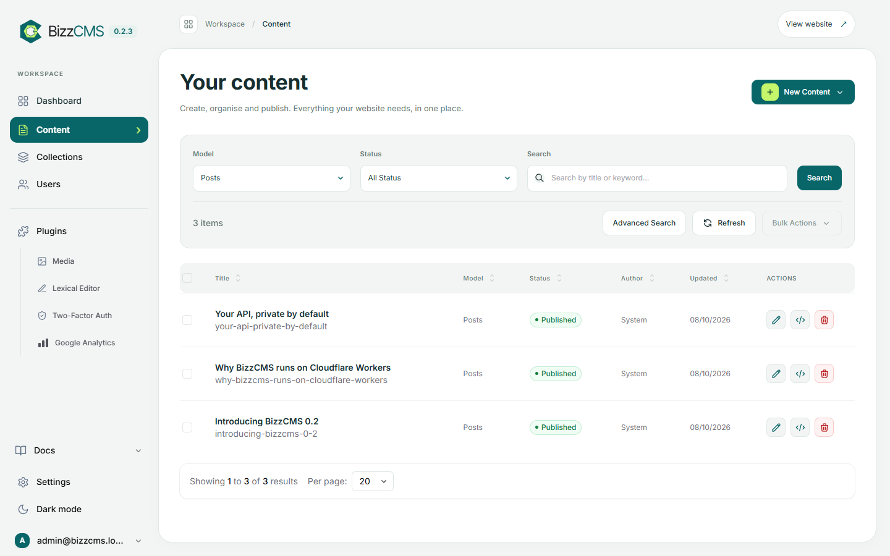
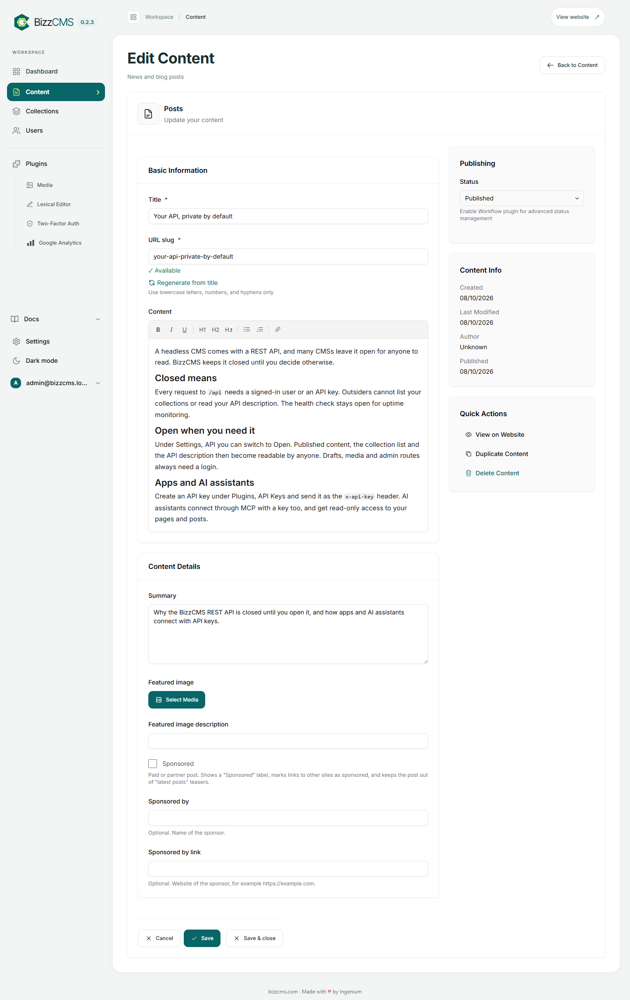
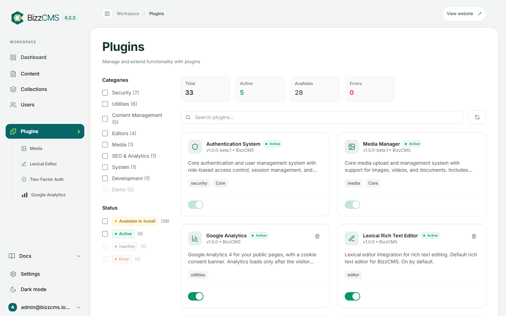
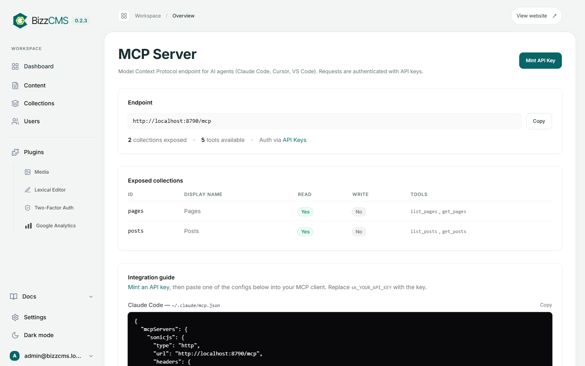
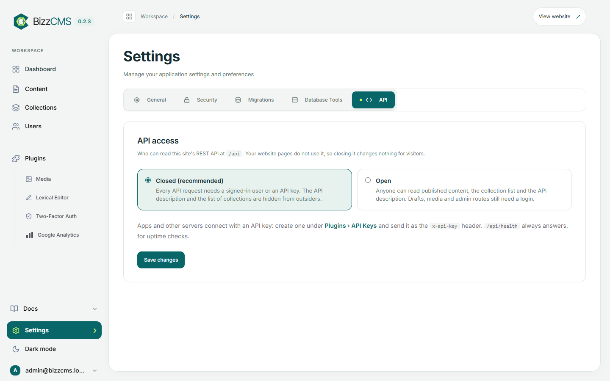
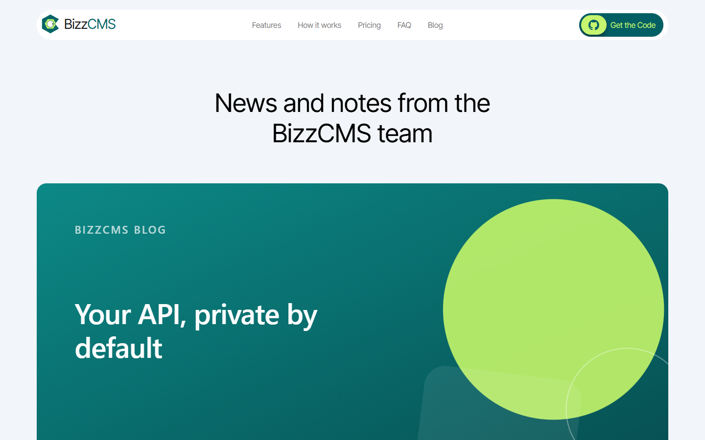

<p align="center">
  
</p>

<h1 align="center">BizzCMS</h1>

<p align="center">
  <strong>A modern CMS. Without the complexity.</strong><br>
  Free, open-source headless CMS for business websites, running on Cloudflare's global network.
</p>

<p align="center">
  <a href="https://bizzcms.com"><strong>bizzcms.com</strong></a> ·
  <a href="https://github.com/BizzCMS/bizzcms/releases">Releases</a> ·
  <a href="CHANGELOG.md">Changelog</a> ·
  <a href="docs/roadmap.md">Roadmap</a> ·
  MIT licence
</p>

<p align="center">
  <a href="https://bizzcms.com"></a>
</p>

---

## Why BizzCMS

Most business websites need the same things: pages, a blog, images, a few people who can edit, and a site that is fast, safe and cheap to run. BizzCMS gives you exactly that, without servers to patch or a plugin jungle to maintain.

- **Serverless by default.** Runs on Cloudflare Workers with D1 (database) and R2 (media). No server, no PHP, no database to babysit.
- **Fast everywhere.** Pages are served from Cloudflare's edge, close to your visitors.
- **Private by default.** The REST API is closed until you open it; apps and AI assistants connect with API keys.
- **Clean, calm admin.** Light and dark mode, one consistent design, built for editors, not developers.
- **Open source.** MIT licensed, no licence fees, your content stays in your own Cloudflare account.

**In production:** [bizzcms.com](https://bizzcms.com) itself runs on BizzCMS (Cloudflare Workers, D1 and R2) since October 2026.

## A look inside

<table>
  <tr>
    <td width="50%"><br><sub><b>Dashboard.</b> Collections, content, media and users at a glance, with live request stats.</sub></td>
    <td width="50%"><br><sub><b>Dark mode.</b> One click in the sidebar, remembered per browser.</sub></td>
  </tr>
  <tr>
    <td><br><sub><b>Your content.</b> Pages and posts with filters, search, status and bulk actions.</sub></td>
    <td><br><sub><b>Post editor.</b> Rich text, featured image, sponsored posts and <i>View on Website</i>.</sub></td>
  </tr>
  <tr>
    <td><br><sub><b>Plugins.</b> Switch features on and off, for example Google Analytics with a cookie banner.</sub></td>
    <td><br><sub><b>MCP server.</b> AI assistants read your pages and posts, read-only, with an API key.</sub></td>
  </tr>
  <tr>
    <td><br><sub><b>API access.</b> Closed (recommended) or open, one switch under Settings.</sub></td>
    <td><br><sub><b>Your website.</b> The bizzcms.com blog, rendered from BizzCMS posts.</sub></td>
  </tr>
</table>

## Features

**Content**
- Pages with SEO title, description and share image; posts with summary and rich text (Lexical editor).
- **Featured images** for posts, picked from the media library, with alt text. Used on blog lists, articles and social share cards.
- **Sponsored posts:** one checkbox adds a "Sponsored" label and "Sponsored by …", marks links to other sites `rel="sponsored"` automatically (as Google requires) and keeps the post out of "latest posts" teasers. See [docs/posts.md](docs/posts.md).
- Media library on R2. Drafts and publishing, with **auto-save every 30 seconds** while you edit.
- Field types for every need: text, rich text, number, date, yes/no, select, media and URL slug.
- **View on Website** from the editor opens the live page, not a technical preview.

**People and security**
- Roles (admin, editor, author) with permissions, invitations and two-step login.
- REST API **closed by default**, with API keys for apps ([docs/api-access.md](docs/api-access.md)).
- Known risky upstream routes are blocked (for example the unauthenticated seed-admin route).

**For developers**
- **Content model as code.** Collections are TypeScript files; the admin forms and the REST API follow from them.
- Modern, small stack: Hono on Cloudflare Workers, D1 (SQLite) for data, R2 for files, KV for caching, server-rendered admin with HTMX.
- Local development with hot reload and full Cloudflare emulation, no account needed.
- A shared admin layer: every BizzCMS site gets the same admin look, fixes and features with one `npm run sync:core`.

**Integrations**
- OpenAPI description of the REST API.
- Read-only **MCP server** for AI assistants: list and read pages and posts ([docs/mcp.md](docs/mcp.md)).
- **Google Analytics plugin** with a consent banner: nothing loads until the visitor accepts (Consent Mode v2).

## Works with Lucy

[Lucy](https://justlucy.ai) is the AI assistant from the team behind BizzCMS. She works with all major AI models and connects to other tools through MCP, so she can read your BizzCMS pages and posts and use them in her answers and tasks:

1. In the BizzCMS admin, open **MCP** and click **Mint API Key**.
2. In Lucy, go to **Connectors › Add custom**.
3. Enter a name, the remote MCP URL `https://your-site.com/mcp` and the API key (just `sk_…`, Lucy adds the Bearer prefix).
4. Choose a model that supports tools and ask Lucy about your content.

Lucy's access is read-only: BizzCMS exposes no write tools over MCP. The same endpoint works with other MCP clients such as Claude Code and Cursor; the admin MCP page has ready-to-copy configs.

## Run locally

Node.js 22 or newer (tested with Node 24 on Windows):

```bash
git clone https://github.com/BizzCMS/bizzcms.git
cd bizzcms
npm ci
npm run setup
npm run dev
```

Open http://127.0.0.1:8787/admin. Setup creates `admin@bizzcms.local` with a random password saved in the gitignored `private/local-admin.txt`. Setup is safe to repeat and never resets your account or content. Later, `npm run dev` is all you need.

No Cloudflare account is needed locally: D1, R2 and KV are emulated under `.wrangler/`, and e-mail is printed to the console instead of sent. See [local development](docs/local-development.md).

## Hosting

| Mode | Application and website | Database | Media | Status |
| --- | --- | --- | --- | --- |
| Cloudflare | Cloudflare Workers | Cloudflare D1 | R2 | **Available**, in production |
| cPanel | Node.js on cPanel | MySQL | R2 or S3 | Planned |
| Hybrid | Node.js on cPanel | Cloudflare D1 | R2 or S3 | Planned |

Media always lives in external storage (R2 or S3), in every mode. PHP is not planned.

## Documentation

- [Architecture and compatibility](docs/architecture.md)
- [Posts: featured image and sponsored posts](docs/posts.md)
- [API access (closed by default)](docs/api-access.md)
- [MCP setup](docs/mcp.md)
- [Branding and admin theme](docs/branding.md)
- [Local development](docs/local-development.md)
- [Product requirements](docs/product-requirements.md), [decisions](docs/decisions.md) and [research](docs/research.md)
- [Roadmap](docs/roadmap.md), [changelog](CHANGELOG.md) and [releasing](docs/releasing.md)
- [Contributing](CONTRIBUTING.md) and [agent instructions](AGENTS.md)

## Licence and attribution

BizzCMS is available under the [MIT licence](LICENSE).

**BizzCMS is built on [SonicJS](https://github.com/lane711/sonicjs)** (pinned to 3.0.0-beta.28). Its licence is preserved in [licenses/sonicjs-MIT.txt](licenses/sonicjs-MIT.txt); see the [third-party notices](THIRD_PARTY_NOTICES.md).

<p align="center">Made with ♥ by <a href="https://ingenium.software/">Ingenium</a></p>
